# operator开发流程

Operator 是 CoreOS 推出的旨在简化复杂有状态应用管理，它是一个感知应用状态的控制器，通过扩展 Kubernetes API 来自动创建、管理和配置应用实例。 Operator 基于 CRD 扩展资源对象，并通过控制器来保证应用处于预期状态。

* 通过 Kubernetes API 观察集群的当前状态；

* 分析当前状态与期望状态的差别；

* 调用k8s API消除这些差别。

  

## 为什么使用crd

Kubernetes 目前已经成为了集群调度领域最炙手可热的开源项目之一 。其内置的 controller一般可以满足大多数使用场景，但对于很多定制化需求，其表达能力还是有限的。因此 Kubernetes 支持 Custom Resource Definition，也就是我们一直提到的 CRD。通过这一特性，用户可以自己定义资源类型，Kubernetes 会将其视为资源的一种，对其提供像内置资源对象一样的支持，这样的实现更加原生。CRD可以大大提高 Kubernetes 的扩展能力 ，以更原生的方式实现定制化要求。


## operator设计初衷

我们在管理应用时，会遇到无状态和有状态的应用。管理无状态的应用是相对来说比较简单的，但是有状态的应用则比较复杂。Operator 的设计旨在简化复杂有状态应用管理，其通过CRD扩展 Kubernetes API 来自动创建、管理和配置应用实例。其本质上是针对特定的场景去做有状态服务，或者说针对复杂应用场景去简化其运维管理的工具。 

Operator以deployment的形式部署到K8S中。部署完这个Operator之后，想要部署一个集群，其实很方便。因为不需要再去管理这个集群的配置信息了，只需要创建一个CRD，指定创建多少个节点，需要什么版本，Operator会监听该资源对象，创建出符合配置要求的集群，从而大大简化运维的难度和成本。


**开发不同中间件operator流程大体相同，下面以redis operator进行说明：**


## 首先准备


- 需要一个资源对象定义（CRD）yaml，operator代码中会根据该yaml去组装并创建CRD。

```yaml
apiVersion: apiextensions.k8s.io/v1beta1
kind: CustomResourceDefinition
metadata:
  name: redisclusters.redis.middleware.hc.cn
spec:
  group: redis.middleware.hc.cn
  version: v1alpha1
  scope: Namespaced
  names:
    kind: RedisCluster
    singular: rediscluster
    listKind: RedisClusterList
    plural: redisclusters
    shortNames:
    - rec
```

​     后面创建的该CRD类型的资源对象（CR），其kind为该yaml描述中spec.names.kind的值。CR相当于CRD的具体实现。（不同的operator，CRD、CR定义不同）；


- 准备一个CR yaml文件，后面operator代码要根据该yaml结构在types.go中定义结构体。redis的CR yaml如下。operator最终会监听该CR，解析里面定义的节点数、版本号等参数，驱动做一些事情。

```yaml
apiVersion: redis.middleware.hc.cn/v1alpha1
kind: RedisCluster
metadata: 
  name: example000-redis-cluster
  namespace: kube-system
spec:
  # 代表redis集群的个数
  replicas: 7
  # 代表是否进入维修状态
  pause: true
  # 是否删除crd以及redis集群
  finalizers: foreground
  # 镜像地址
  repository: library/redis
  # 镜像版本，便于后续多版本特化支持
  version: 3.2.8
  #redis集群升级策略
  updateStrategy:
    # 升级类型为AutoReceive（自动分配,不用AssignStrategies）, AssignReceive（指定值分配，需要用AssignStrategies）
    type: AssignReceive
    pipeline: "100"
    assignStrategies:
       - 
        slots: 2000
        fromReplicas: nodeId1
       - 
        # 从nodeId3,nodeId4一共分配1000个卡槽
        slots: 1000 
        # 多个nodeId用逗号分隔
        fromReplicas: nodeId3,nodeId4
  # redis 实例配置详情
  pod:
    # 标签管理：map[string][string]
  - labels:
      key: value
    # 备注管理：map[string][string]
    annotations:
      key: value
    # 环境变量管理
    env:
    - name: tony
      value: aa
    - name: MAXMEMORY
      value: 2gb    
    # 亲和性管理
    affinity: 
      nodeAffinity:
      requiredDuringSchedulingIgnoredDuringExecution:
        nodeSelectorTerms:
        - matchExpressions:
          - key: HarmonyCloud_Status
            operator: In
            values:
            - C
      podAntiAffinity: {}
    # 资源管理
    resources:
      limits: 
        #cpu, memory, storage,ephemeral-storage
        cpu: "2"
        memory: 4Gi
      requests:
        cpu: "1"
        memory: 2Gi
    #statefulset更新模式
    updateStrategy:
      type: RollingUpdate
    # 支持挂载形式： hostPath(不需要persistentVolumeClaimName)，nfs(需要persistentVolumeClaimName)
    volumes:
      type: nfs
      persistentVolumeClaimName: pvcName
    # 配置文件模板名
    configmap: name
    # 监控镜像
    monitorImage: string
    # 初始化镜像
    initImage: string
    # 中间件容器镜像
    middlewareImage: string

status:
  #当前statefulset replicas情况
  replicas: 6
  # 集群阶段,None,Creating,Running,Failed,Scaling
  # None 或 “”， 就是代表该CRD刚创建
  # Creating 代表等待redis资源对象创建完毕（operator 发现CRD创建，创建资源对象，更新状态）
  # Running 代表已进行初始化操作（在Creating之后，发现实例起来完毕，初始化操作）
  # Failed 代表着某异常故障
  # ---------------------
  # Scaling 代表着实例不一致(用户修改实例，operator发现实例不一致，更新statefulset，更新状态)
  # Upgrading 代表着升级中
  # ---------------------
  phase: Creating
  # 异常问题解释
  reason: "异常问题"
  conditions:
  - name: redis-cluster-0
    instance: 10.168.78.90:6379
    type: master
    masterNodeId: allkk111snknkcs
    nodeId: allkk111snknkcs
    domainName: redis-cluster-0.redis-cluster.kube-system.svc.cluster.local
    slots: 1024-2048
    hostname: docker-vm-3
    hostIP: 192.168.26.122
    # true or flase 
    status: "True"
    reason: xxxx
    message: xxxx
    lastTransitionTime: 2019-03-25T03:10:29Z
```


## 代码生成


主要生成符合k8s风格的代码：

* 生成风格统一的DeepCopy（CustomResources必须实现runtime.Object接口——必须实现DeepCopy方法）；

* clientset（自定义资源对象的客户端）；

* listers（用来提供对于 GET/List 资源对象的请求提供只读缓存层）；

* informers（List/Get 资源对象，还可以监听事件并触发回调函数。

  

结构体定义到$ProjectName/pkg/apis/{中间件名称}/{版本号}/types.go里：

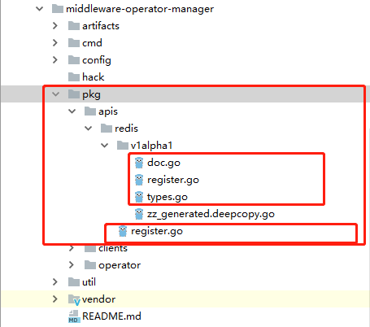


types.go中结构体定义根据上面准备的CR yaml定义。如下，其中需要注意的是，必须要给结构体加以下两个注解：

* // +k8s:deepcopy-gen:interfaces=k8s.io/apimachinery/pkg/runtime.Object注解表示：为该类型生成 func (t* T) DeepCopy() *T方法。API类型都需要实现深拷贝；
* // +genclient注解表示为当前类型生成客户端。

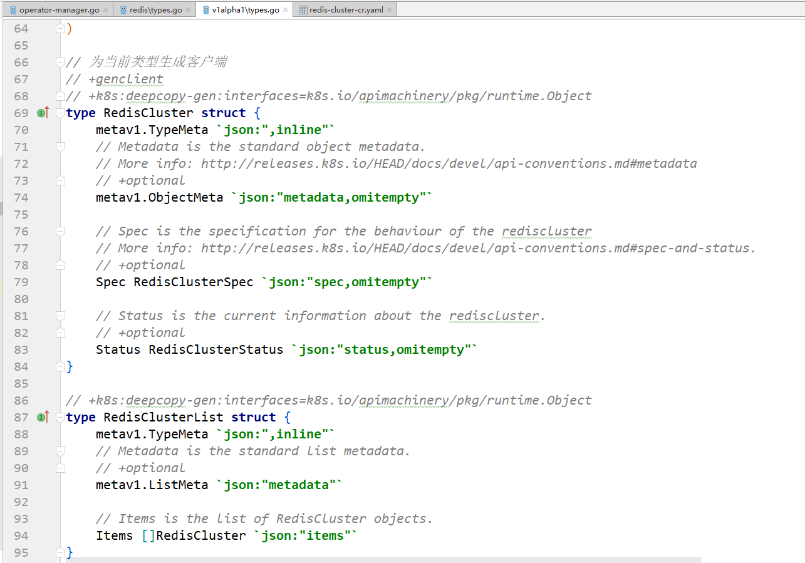


3、编写$ProjectName/pkg/apis/{中间件名称}/{版本号}/doc.go，其中定义全局tag：// +k8s:deepcopy-gen=package，表示为包中任何类型生成深拷贝方法。package指定版本。

4、编写$ProjectName/pkg/apis/{中间件名称}/{版本号}/register.go，通过scheme注册自定义CR类型，这样当和API Server通信的时候就能够处理该类型；（不同operator需要修改SchemeGroupVersion的Group和Version以及addKnownTypes中注册的结构体）

```go
package v1alpha1

import (
	"harmonycloud.cn/middleware-operator-manager/pkg/apis/redis"
	v1 "k8s.io/apimachinery/pkg/apis/meta/v1"
	"k8s.io/apimachinery/pkg/runtime"
	"k8s.io/apimachinery/pkg/runtime/schema"
)

// SchemeGroupVersion is group version used to register these objects
var SchemeGroupVersion = schema.GroupVersion {Group: redis.GroupName, Version: "v1alpha1"}

// Kind takes an unqualified kind and returns back a Group qualified GroupKind
func Kind(kind string) schema.GroupKind {
	return SchemeGroupVersion.WithKind(kind).GroupKind()
}

// Resource takes an unqualified resource and returns a Group qualified GroupResource
func Resource(resource string) schema.GroupResource {
	return SchemeGroupVersion.WithResource(resource).GroupResource()
}

var (
	SchemeBuilder = runtime.NewSchemeBuilder(addKnownTypes)
	AddToScheme   = SchemeBuilder.AddToScheme
)

//注册CR对象
// Adds the list of known types to Scheme.
func addKnownTypes(scheme *runtime.Scheme) error {
	scheme.AddKnownTypes(SchemeGroupVersion,
		&RedisCluster{},
		&RedisClusterList{},
	)
	v1.AddToGroupVersion(scheme, SchemeGroupVersion)
	return nil
}
```

5、编写$ProjectName/pkg/apis/{中间件名称}/register.go，其中定义了上一步用到的GroupName；

6、使用kubernetes提供的code-generator代码生成器工具，根据定义好的CR结构体对象生成风格统一的DeepCopy（CustomResources必须实现runtime.Object接口——必须实现DeepCopy方法）、clientset（自定义资源对象的客户端）、listers（用来提供对于 GET/List 资源对象的请求提供只读缓存层）、informers（List/Get 资源对象，还可以监听事件并触发回调函数）代码。

code-generator地址如下，下载后放到$GOPATH/src/k8s.io/目录下：

<https://github.com/kubernetes/code-generator> 

然后执行以下命令，harmonycloud.cn/middleware-operator-manager/pkg/clients表示最终生成的clientset、informers、listers代码目录，最后的redis:v1alpha1需要改成{中间件名称}:{版本}

```sh
./generate-groups.sh all "harmonycloud.cn/middleware-operator-manager/pkg/clients" "harmonycloud.cn/middleware-operator-manager/pkg/apis" "redis:v1alpha1"
```

执行后将生成以下代码：

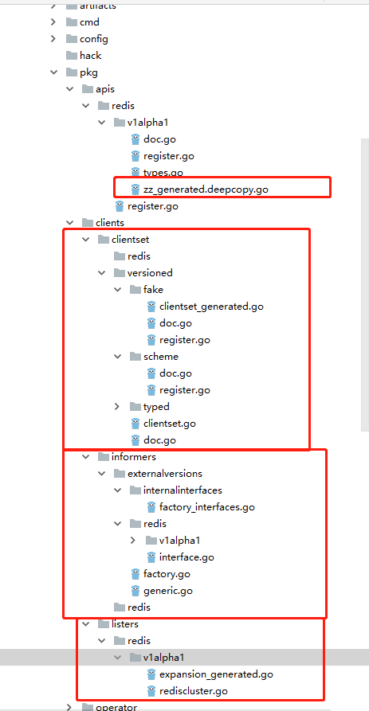


参考：

[通过自定义资源扩展Kubernetes](<https://blog.gmem.cc/extend-kubernetes-with-custom-resources> )

[Extending Kubernetes: Create Controllers for Core and Custom Resources](<https://medium.com/@trstringer/create-kubernetes-controllers-for-core-and-custom-resources-62fc35ad64a3> )


## operator主流程代码开发


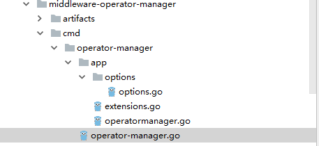

首先operator的入口为operator-manager.go里的main函数。

```go
package main

import (
	"fmt"
	"github.com/spf13/pflag"
	"harmonycloud.cn/middleware-operator-manager/cmd/operator-manager/app"
	"harmonycloud.cn/middleware-operator-manager/cmd/operator-manager/app/options"
	"k8s.io/apiserver/pkg/util/flag"
	"k8s.io/apiserver/pkg/util/logs"
	"k8s.io/kubernetes/pkg/version/verflag"
	"os"
)

func main() {
    //参数初始化配置
	s := options.NewOMServer()
	s.AddFlags(pflag.CommandLine, app.KnownOperators())

	flag.InitFlags()
    //日志初始化
	logs.InitLogs()
	defer logs.FlushLogs()

	verflag.PrintAndExitIfRequested()
	//进行operator初始化
	if err := app.Run(s); err != nil {
		fmt.Fprintf(os.Stderr, "%v\n", err)
		os.Exit(1)
	}
}
```

main函数中首先进行对参数的初始化，其中主要包括：operator多实例时的选主配置；事件同步时间；集群创建、升级超时时间；是否启用leader功能；是否开启pprof分析功能等，代码在options.go中。

app.Run(s)根据参数配置进行operator初始化：

* 首先根据参数配置，构建默认客户端（操作k8s已有资源对象）、leader选举客户端、操作扩展资源客户端等；
* 之后创建CRD资源对象定义，后续创建的CR对象都是该CRD的实例；
* 注册健康检查接口、根据启动参数配置决定是否开启pprof分析接口功能；
* 创建recorder，主要用于记录events（k8s资源），用于操作审计；
* 定义Run函数，进行启动operator，选举结果的leader执行该函数；
* 判断是否开启leader选举功能；
*  创建leader选举的资源锁，目前资源锁实现了configmaps和endpoints方式，具体代码在client-go下，默认使用endpoints方式；
* 启动leader选举机制，争抢到锁，选举为leader的实例执行OnStartedLeading，即上面定义的Run函数；失去锁的实例执行OnStoppedLeading函数。

```go
// Run runs the OMServer.  This should never exit.
func Run(s *options.OperatorManagerServer) error {
	// To help debugging, immediately log version
	glog.Infof("Version: %+v", version.Get())

    //根据参数配置，构建默认客户端（操作k8s已有资源对象）、leader选举客户端、操作扩展资源客户端等
	kubeClient, leaderElectionClient, extensionCRClient, kubeconfig, err := createClients(s)

	if err != nil {
		return err
	}

    //根据提前准备好的CRD yaml文件，构建并创建CRD
	err = CreateRedisClusterCRD(extensionCRClient)
	if err != nil {
		if errors.IsAlreadyExists(err) {
			glog.Infof("redis cluster crd is already created.")
		} else {
			fmt.Fprint(os.Stderr, err)
			return err
		}
	}

    //注册健康检查接口、根据启动参数配置决定是否开启pprof分析接口功能
	go startHTTP(s)

    //创建recorder，主要用于记录events（k8s资源）
	recorder := createRecorder(kubeClient)

    //定义Run函数，进行启动operator，选举结果的leader执行该函数
	run := func(stop <-chan struct{}) {
		operatorClientBuilder := operator.SimpleOperatorClientBuilder{
			ClientConfig: kubeconfig,
		}

		rootClientBuilder := controller.SimpleControllerClientBuilder{
			ClientConfig: kubeconfig,
		}

		otx, err := CreateOperatorContext(s, kubeconfig, operatorClientBuilder, rootClientBuilder, stop)
		if err != nil {
			glog.Fatalf("error building controller context: %v", err)
		}

		otx.InformerFactory = informers.NewSharedInformerFactory(kubeClient, time.Duration(s.ResyncPeriod)*time.Second)

		if err := StartOperators(otx, NewOperatorInitializers()); err != nil {
			glog.Fatalf("error starting operators: %v", err)
		}

		otx.RedisInformerFactory.Start(otx.Stop)
		otx.InformerFactory.Start(otx.Stop)
		close(otx.InformersStarted)

		select {}
	}

    //判断是否开启leader选举功能
	if !s.LeaderElection.LeaderElect {
		run(nil)
		panic("unreachable")
	}

	id, err := os.Hostname()
	if err != nil {
		return err
	}

    //创建leader选举的资源锁，目前资源锁实现了configmaps和endpoints方式，具体代码在client-go下，默认使用endpoints方式
	rl, err := resourcelock.New(s.LeaderElection.ResourceLock,
		"kube-system",
		"middleware-operator-manager",
		leaderElectionClient.CoreV1(),
		resourcelock.ResourceLockConfig{
			Identity:      id,
			EventRecorder: recorder,
		})
	if err != nil {
		glog.Fatalf("error creating lock: %v", err)
	}

    //启动leader选举机制，争抢到锁，选举为leader的实例执行OnStartedLeading，即上面定义的Run函数；失去锁的实例执行OnStoppedLeading函数
	leaderelection.RunOrDie(leaderelection.LeaderElectionConfig{
		Lock:          rl,
		LeaseDuration: s.LeaderElection.LeaseDuration.Duration,
		RenewDeadline: s.LeaderElection.RenewDeadline.Duration,
		RetryPeriod:   s.LeaderElection.RetryPeriod.Duration,
		Callbacks: leaderelection.LeaderCallbacks{
			OnStartedLeading: run,
			OnStoppedLeading: func() {
				glog.Fatalf("leaderelection lost")
			},
		},
	})
	panic("unreachable")
}
```

CreateRedisClusterCRD方法根据上面准备的CRD yaml文件构建并创建CRD，只有创建了该CRD，redisCluster资源对象才可以被创建。

```go
func CreateRedisClusterCRD(extensionCRClient *extensionsclient.Clientset) error {
	//TODO add CustomResourceValidation due to guarantee redis operator work normally,k8s1.12
	crd := &v1beta1.CustomResourceDefinition{
		ObjectMeta: metav1.ObjectMeta{
			Name: "redisclusters." + v1alpha1.SchemeGroupVersion.Group,
		},
		Spec: v1beta1.CustomResourceDefinitionSpec{
			Group:   v1alpha1.SchemeGroupVersion.Group,
			Version: v1alpha1.SchemeGroupVersion.Version,
			Scope:   v1beta1.NamespaceScoped,
			Names: v1beta1.CustomResourceDefinitionNames{
				Kind:       "RedisCluster",
				ListKind:   "RedisClusterList",
				Plural:     "redisclusters",
				Singular:   "rediscluster",
				ShortNames: []string{"rec"},
			},
		},
	}
	_, err := extensionCRClient.ApiextensionsV1beta1().CustomResourceDefinitions().Create(crd)
	return err
}
```

CR的apiVersion为CRD的spec.Group/spec.Version即生成代码时register.go中的GroupName和doc.go中的版本号：

```yaml
apiVersion: redis.middleware.hc.cn/v1alpha1
kind: RedisCluster
metadata: 
  name: example000-redis-cluster
  namespace: kube-system
```


Run函数中主要创建context对象，context里包含启动参数options，kubeconfig配置、RedisInformerFactory（监听CR变化）、InformerFactory（监听statefulsetset变化）等，进行启动operator、启动informer。

```go
run := func(stop <-chan struct{}) {
		operatorClientBuilder := operator.SimpleOperatorClientBuilder{
			ClientConfig: kubeconfig,
		}

		rootClientBuilder := controller.SimpleControllerClientBuilder{
			ClientConfig: kubeconfig,
		}
         //创建context对象，context里包含启动参数options，kubeconfig配置、RedisInformerFactory（监听CR变化）、InformerFactory（监听statefulsetset变化）等
		otx, err := CreateOperatorContext(s, kubeconfig, operatorClientBuilder, rootClientBuilder, stop)
		if err != nil {
			glog.Fatalf("error building controller context: %v", err)
		}

    	//创建InformerFactory
		otx.InformerFactory = informers.NewSharedInformerFactory(kubeClient, time.Duration(s.ResyncPeriod)*time.Second)

    	//启动operator，NewOperatorInitializers()中定义了启动哪些operator
		if err := StartOperators(otx, NewOperatorInitializers()); err != nil {
			glog.Fatalf("error starting operators: %v", err)
		}
		//启动RedisInformerFactory
		otx.RedisInformerFactory.Start(otx.Stop)
   		//启动InformerFactory
		otx.InformerFactory.Start(otx.Stop)
		close(otx.InformersStarted)
		//阻塞
		select {}
	}
```

NewOperatorInitializers()中定义了启动哪些operator（新加operator直接在该方法中加）：

```go
func NewOperatorInitializers() map[string]InitFunc {
	controllers := map[string]InitFunc{}
	controllers["rediscluster"] = startRedisClusterController

	return controllers
}
```

CreateOperatorContext函数里根据代码生成器生成的redis客户端versionedClient创建了RedisInformerFactory；（根据不同operator生成不同的客户端，这里需要修改client_builder.go中ClientOrDie的返回值类型），最终创建context对象。

```go
func CreateOperatorContext(s *options.OperatorManagerServer, kubeConfig *restclient.Config, operatorClientBuilder operator.OperatorClientBuilder, rootClientBuilder controller.ControllerClientBuilder, stop <-chan struct{}) (OperatorContext, error) {
	versionedClient := operatorClientBuilder.ClientOrDie("middleware-shared-informers")
	sharedInformers := redisInformerFactory.NewSharedInformerFactory(versionedClient, time.Duration(s.ResyncPeriod)*time.Second)

	/*availableResources, err := GetAvailableResources(rootClientBuilder)
	if err != nil {
		return OperatorContext{}, err
	}*/

	otx := OperatorContext{
		kubeConfig:            kubeConfig,
		OperatorClientBuilder: operatorClientBuilder,
		DefaultClientBuilder:  rootClientBuilder,
		RedisInformerFactory:  sharedInformers,
		Options:               *s,
		//AvailableResources: availableResources,
		Stop:             stop,
		InformersStarted: make(chan struct{}),
	}
	return otx, nil
}
```

StartOperators函数启动所有NewOperatorInitializers中定义的operator，执行startRedisClusterController函数。（不同operator执行不同的启动函数）。

startRedisClusterController定义在extensions.go中，用于创建operator、启动worker协程从队列中取出（用于处理informer监听变化的资源对象）进行业务逻辑处理。（新增operator需要在extensions.go中增加对应的start函数）

```go
func startRedisClusterController(otx OperatorContext) (bool, error) {
	//创建redisOperator
	rco, err := redis.NewRedisClusterOperator(
        //注册RedisInformer回调函数
		otx.RedisInformerFactory.Cr().V1alpha1().RedisClusters(),
         //注册statefulsetInformer回调函数
		otx.InformerFactory.Apps().V1().StatefulSets(),
        //默认客户端，用于操作k8s自身资源对象
		otx.DefaultClientBuilder.ClientOrDie("default-kube-client"),
        //代码生成器生成的客户端，用于操作CR
		otx.OperatorClientBuilder.ClientOrDie("rediscluster-operator"),
        //kubeconfig配置
		otx.kubeConfig,
        //启动参数配置
		otx.Options,
	)
	if err != nil {
		return true, fmt.Errorf("error creating rediscluster operator: %v", err)
	}
    //启动ConcurrentRedisClusterSyncs个worker协程处理变化的资源对象
	go rco.Run(int(otx.Options.ConcurrentRedisClusterSyncs), otx.Stop)
	return true, nil
}
```

NewRedisClusterOperator方法如下，主要创建该operator的结构体，队列，redisInformer注册回调函数，statefulsetInformer回调函数的注册。（不同的operator，需要不同的Informer、处理业务逻辑的方法）

```go
func NewRedisClusterOperator(redisInformer custominfomer.RedisClusterInformer, stsInformer appsinformers.StatefulSetInformer, kubeClient clientset.Interface, customCRDClient customclient.Interface, kubeConfig *rest.Config, options options.OperatorManagerServer) (*RedisClusterOperator, error) {
    //创建该operator的recorder，记录events
	eventBroadcaster := record.NewBroadcaster()
	eventBroadcaster.StartLogging(glog.Infof)
	eventBroadcaster.StartRecordingToSink(&v1core.EventSinkImpl{Interface: v1core.New(kubeClient.CoreV1().RESTClient()).Events("")})
 //创建该operator的结构体
	rco := &RedisClusterOperator{
		options:       &options,
		kubeConfig:    kubeConfig,
		defaultClient: kubeClient,
		//extensionCRClient: extensionCRClient,
		customCRDClient: customCRDClient,
		eventRecorder:   eventBroadcaster.NewRecorder(scheme.Scheme, v1.EventSource{Component: "operator-manager"}),
		queue:           workqueue.NewNamedRateLimitingQueue(workqueue.DefaultControllerRateLimiter(), "rediscluster"),
	}

    //redisInformer注册回调函数，当informer监听到redis CR资源变化时，调用对应AddFunc、UpdateFunc、DeleteFunc回调函数将CR资源放到queue中
	redisInformer.Informer().AddEventHandler(cache.ResourceEventHandlerFuncs{
		AddFunc:    rco.addRedisCluster,
		UpdateFunc: rco.updateRedisCluster,
		// This will enter the sync loop and no-op, because the RedisCluster has been deleted from the store.
		DeleteFunc: rco.deleteRedisCluster,
	})

    //定义最终处理业务逻辑的函数
	rco.syncHandler = rco.syncRedisCluster
	rco.enqueueRedisCluster = rco.enqueue

	rco.redisClusterInformer = redisInformer.Informer()
    //redisInformer是否已经开始同步事件变化
	rco.redisClusterListerSynced = rco.redisClusterInformer.HasSynced
    //lister提供操作informer中缓存的变化的资源接口
	rco.redisClusterLister = redisInformer.Lister()

     //statefulsetInformer注册回调函数，当informer监听到statefulset资源变化时，调用对应AddFunc、UpdateFunc、DeleteFunc回调函数将redis实例的statefulset加入到queue中
	stsInformer.Informer().AddEventHandler(
		cache.ResourceEventHandlerFuncs{
			AddFunc: rco.addStatefulSet,
			UpdateFunc: func(old, cur interface{}) {
				oldSts := old.(*appsv1.StatefulSet)
				curSts := cur.(*appsv1.StatefulSet)
				if oldSts.Status.Replicas != curSts.Status.Replicas {
					glog.V(4).Infof("Observed updated replica count for StatefulSet: %v, %d->%d", curSts.Name, oldSts.Status.Replicas, curSts.Status.Replicas)
				}
				rco.updateStatefulSet(oldSts, curSts)
			},
			DeleteFunc: rco.deleteStatefulSet,
		},
	)
	rco.stsLister = stsInformer.Lister()
    //statefulsetInformer是否已经开始同步事件变化
	rco.stsListerSynced = stsInformer.Informer().HasSynced

	return rco, nil
}
```

Run函数中等待redis CR资源、statefulset资源对象同步，然后启动指定个数worker，并永久阻塞，直到stopCh被close（不同operator需要修改rco.redisClusterListerSynced为对应的ListerSynced）

```go
func (rco *RedisClusterOperator) Run(workers int, stopCh <-chan struct{}) {
	defer utilruntime.HandleCrash()
	defer rco.queue.ShutDown()

	glog.Infof("Starting rediscluster operator")
	defer glog.Infof("Shutting down rediscluster operator")

    //等待redis CR资源、statefulset资源对象同步。
	if !controller.WaitForCacheSync("rediscluster", stopCh, rco.redisClusterListerSynced, rco.stsListerSynced) {
		return
	}

    //循环启动指定个数worker，并永久阻塞，直到stopCh被close
	for i := 0; i < workers; i++ {
		go wait.Until(rco.worker, time.Second, stopCh)
	}

	<-stopCh
}
```

worker方法死循环rco.processNextWorkItem()在队列Operator中定义的queue中取出变化的资源去处理（不同operator有不同的业务处理逻辑）

```go
func (rco *RedisClusterOperator) worker() {
	for rco.processNextWorkItem() {
	}
}
```

从informer监听到资源对象变化，回调函数将资源对象key（namespace/name）放到queue中，到worker取出queue中的key去做处理，处理完成后Done掉key流程图如下：

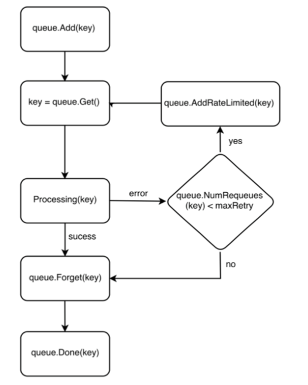


回调函数将资源对象的key加入到queue中，worker从queue中取出key去处理业务，此时key会被放到processing集合中，表示该key正在被处理。worker处理key时如果遇到错误，该key会根据重试次数是否大于最大重试次数被加入到rateLimited（可以限制添加到queue中速度，最终还会被加入到queue）。worker处理key成功后，Forget(key)表示从rateLimited中清除，Done(key)表示key处理完毕，从processing集合中删除。该代码如下：

```go
func (rco *RedisClusterOperator) processNextWorkItem() bool {
	key, quit := rco.queue.Get()

	if quit {
		return false
	}

	// Done marks item as done processing, and if it has been marked as dirty again
	// while it was being processed, it will be re-added to the queue for
	// re-processing.
	defer rco.queue.Done(key)

	err := rco.syncHandler(key.(string))
    //加入到rateLimited中、forget(key)
	rco.handleErr(err, key)

    //处理key，主业务逻辑
	go rco.syncHandler(key.(string))

	return true
}
```


## 开发注意事项

* 开启worker时，调用cache.WaitForCacheSync等待缓存开始同步。

  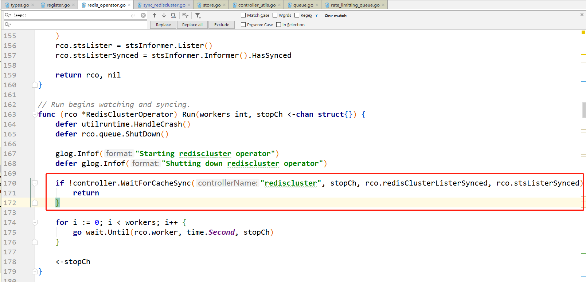

* 不要改变原始对象（从lister中取出的对象），而要使用DeepCopy，因为缓存在informer之间共享。

  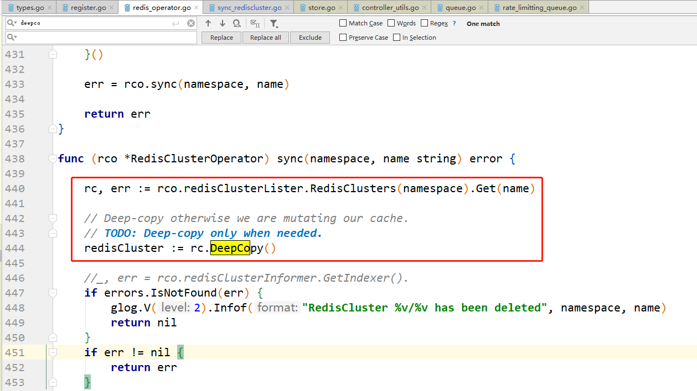

  

* 根据CRD构建Statefulset时，给Statefulset加OwnerReferences，这样在删除CRD的时候，可以设置是否级联删除statefulset。

  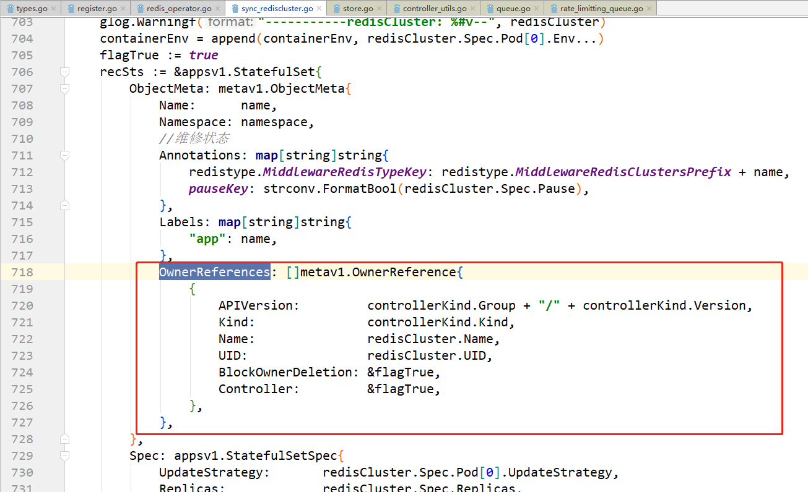


## 调试

本地用IDE--goland调试代码时，配置如下：


Run kind：选File；

Files：指定main函数所在文件的全路径；

Output directory：指定编译后输出的二进制文件位置。可输入。（默认输出exe格式windows可执行文件）

Run after build：勾选后，编译完成后运行。

Go tool arguments：填写-i（用于增量编译提速）。

Program arguments：用于指定程序启动参数：

```sh
--kubeconfig=D:\SoftwareAndProgram\program\Go\Development\src\harmonycloud.cn\middleware-operator-manager\artifacts\config60 --v=5
```

--kubeconfig指定kubeconfig文件所在全路径（即k8s集群master节点的/root/.kube/config），其指定k8s集群apiserver地址已经访问时的证书信息。

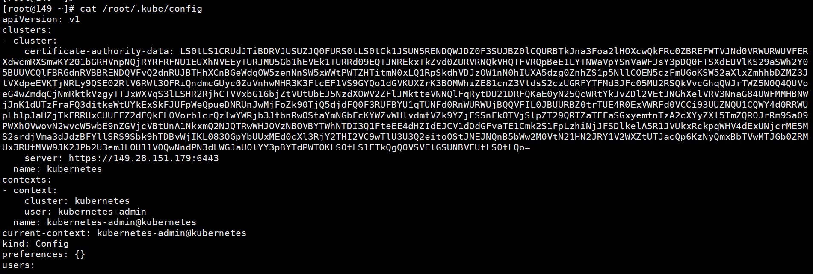

--v指定glog日志级别，--v=5表示只输出info小于5和error、warn日志。

```go
glog.V(4).Infof("Adding RedisCluster %s", rc.Name)
glog.Warningf("-----------redisCluster: %#v--", redisCluster)
glog.Errorf(err.Error())
```


## 镜像制作

#####  编译前提

提前安装好go语言开发环境，正确设置GOROOT和GOPATH环境变量，要求go1.8.3版本以上

##### 编译二进制

将`middleware-operator-manager`放在`$GOPATH/src/harmonycloud.cn/`目录下，进入到 `$GOPATH/src/harmonycloud.cn/middleware-operator-manager/cmd/operator-manager`目录， 最终要生成linux的可执行文件：

- 如果是在windows上编译：

打开cmd窗口，进入以上目录后，执行以下命令：

```sh
set GOOS=linux
go build -a -o operator-manager
```

- 如果是在linux上编译：

执行以下命令：

```shell
go build -a -o operator-manager
```

等待编译完成，最终在当前目录下生成operator-manager可执行文件

##### 镜像制作

`$GOPATH/src/harmonycloud.cn/middleware-operator-manager/artifacts`目录下有Dockerfile文件，基础镜像为busybox

```dockerfile
FROM busybox

ADD operator-manager /usr/bin/ 
RUN chmod +x /usr/bin/operator-manager
```

同级目录下有operator-manager deployment描述文件operator-manager.yaml:

```yaml
apiVersion: extensions/v1beta1
kind: Deployment
metadata:
  generation: 2
  labels:
    app: operator-manager
  name: operator-manager
  namespace: kube-system
spec:
  replicas: 2
  selector:
    matchLabels:
      app: operator-manager
  strategy:
    rollingUpdate:
      maxSurge: 1
      maxUnavailable: 1
    type: RollingUpdate
  template:
    metadata:
      creationTimestamp: null
      labels:
        app: operator-manager
    spec:
      containers:
      - command:
        - operator-manager
        - --v=5
        - --leader-elect=true
        image: 192.168.26.46/k8s-deploy/operator-manager:v1
        resources:
          limits:
            cpu: 500m
            memory: 512Mi
          requests:
            cpu: 200m
            memory: 512Mi
        imagePullPolicy: Always
        name: operator-manager
        terminationMessagePath: /dev/termination-log
        terminationMessagePolicy: File
      dnsPolicy: ClusterFirst
      restartPolicy: Always
      schedulerName: default-scheduler
      securityContext: {}
      terminationGracePeriodSeconds: 30
```

同级目录下有build.sh脚本，指定了docker镜像仓库地址为192.168.26.46

```shell
#!/bin/bash

docker build -f ./Dockerfile -t operator-manager:v1 .
docker tag operator-manager:v1 192.168.26.46/k8s-deploy/operator-manager:v1
docker push 192.168.26.46/k8s-deploy/operator-manager:v1
kubectl apply -f operator-manager.yaml
```

执行该脚本即可以将operator-manager二进制打成镜像并推送到192.168.26.46仓库的k8s-deploy项目下： 同时执行了

```sh
kubectl apply -f operator-manager.yaml
```

命令创建了operator-manager的deployment对象，完成了部署。

## operator高可用

用k8s组件中leader选举机制实现redis operator组件的高可用，即正常情况下redis operator组件的多个副本只有一个是处于业务逻辑运行状态，其它副本则不断的尝试去获取锁，去竞争leader，直到自己成为leader。如果正在运行的leader因某种原因导致当前进程退出，或者锁丢失，则由其它副本去竞争新的leader，获取leader继而执行业务逻辑。 

启动两个operator-manager实例：

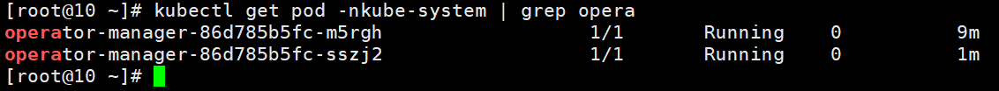

可以看到只有一个实例operator-manager-86d785b5fc-m5rgh在同步事件，处理业务：

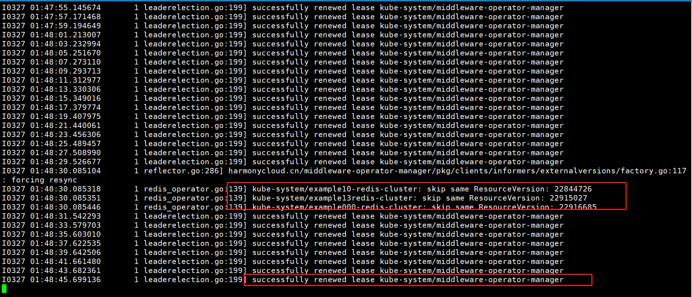

operator-manager-86d785b5fc-sszj2实例一直在竞争尝试获取锁：

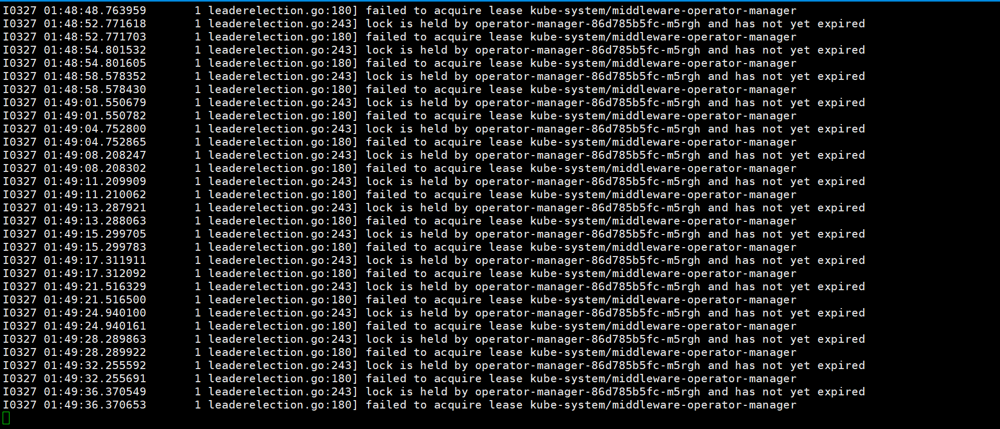

删除掉正在同步事件的实例operator-manager-86d785b5fc-m5rgh：

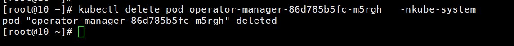

实例operator-manager-86d785b5fc-sszj2竞争获取到锁，开始处理业务逻辑：

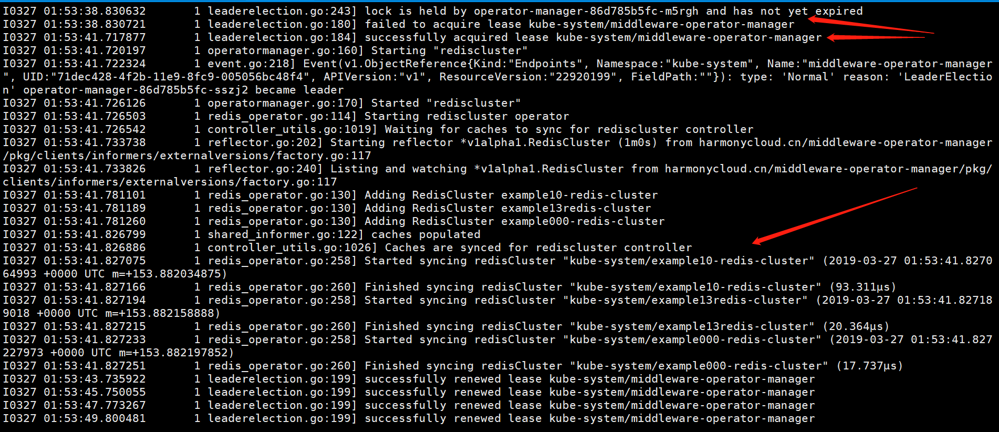

故可以通过反亲和性防止两个operator-manager实例调度到同一主机上，达到主备高可用。


